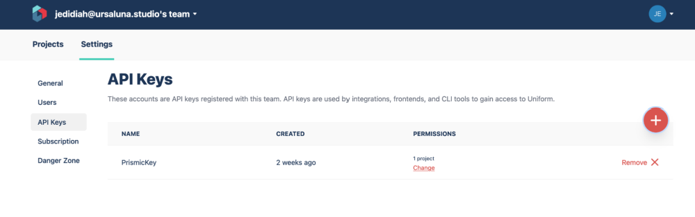
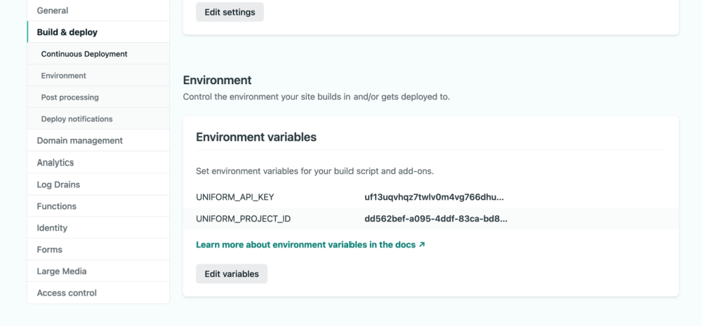
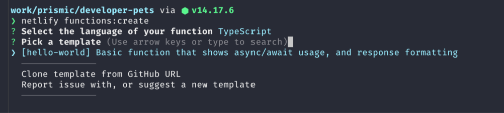
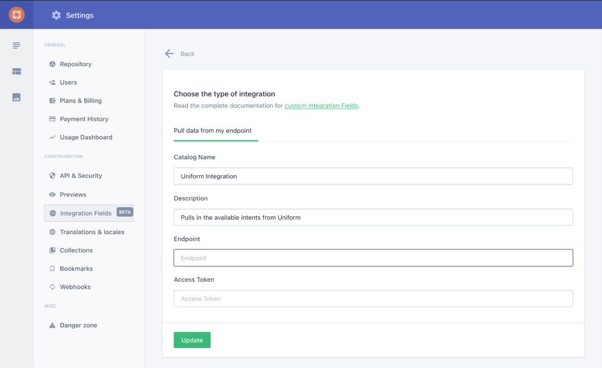
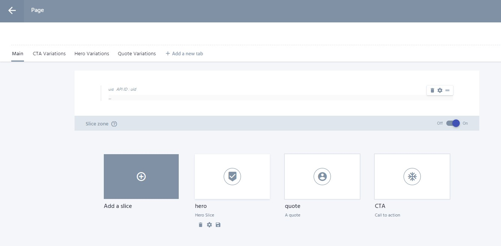
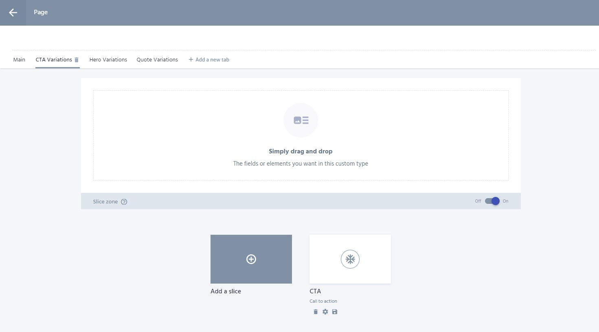
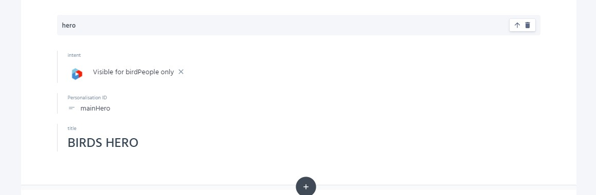

# Uniform SliceZone for Prismic

This module contains a custom SliceZone component and a serverless function that together helps you to use [Uniform Personalisation](https://uniform.dev/) with [Prismic](https://prismic.io/).

---

## Installation

Add the module to your `package.json` using either `yarn add @jedidiah/uniform-slicezone` or `npm install --save @jedidiah/uniform-slicezone`.

## Setup (Next.js + Netlify)

> ℹ️ ☛ This guide assumes you already have a Prismic site hosted on Netlify and want to add Uniform Personalisation to it.

There's a little bit of setup getting the two platforms connected but once it's up and running the integration works seamlessly and is pretty simple for the content editor to add new variations.

### What we are going to do:

- First step is to contact Prismic support and tell them they're awesome, then ask them to enable Custom Integrations for your account, as at the time of writing it is still in beta.
- Then we need to create a Uniform account (if you don't have one already) and create a project. Once you have your project created head to the top-level settings for your Uniform account and create a new API Key with READ permissions for the Intent Manifest on the project, make sure you take a note of the key and project ID as we will use them in the next step. 

- After that we'll create a serverless function that can be called as a webhook by Prismic. This function will fetch the intents from Uniform and push them to the custom integration in Prismic.

- Next we will update the models for our slices on Prismic to include the new custom integration and a variationId.

- Once everything else is in place we are going to replace the standard SliceZone component with the UniformSliceZone component.

  ***

### Creating the Serverless function

Before we start we're going to setup two environment variables for our Uniform project ID and API Key. Add the following lines to `.env.local` making sure to paste the appropriate values taken from Uniform. If the file doesn't exist create it.

```sh
UNIFORM_PROJECT_ID=""
UNIFORM_API_KEY=""
```

As the name suggests this env file is only used locally and should be git ignored, this means we also need to add the enviroment variables to Netlify in the settings for the site (Or wherever you are creating your serverless function).



Next we need to create a new serverless function, we can do this using the netlify cli by running `netlify functions:create`.



At the prompts choose TypeScript for the language and it doesn't matter what you pick for template as we will be replacing the contents anyway.

Open up the new function that was just created and replace the contents with the following

```typescript
import { Handler } from "@netlify/functions";
import { fetchIntents } from "@jedidiah/uniform-slicezone";

export const handler: Handler = async () =>
  (await fetchIntents(
    String(process.env.UNIFORM_API_KEY),
    String(process.env.UNIFORM_PROJECT_ID)
  )) || { statusCode: 500 };
```

If you want to see what the fetchItents function is doing or want to make your own customised version of it [check out the source](https://github.com/Jedidiah/uniform-slicezone/blob/main/src/integration.ts). Thank you to [Tim Benniks](https://timbenniks.dev/) for creating the example integration that this is based on.

Commit your changes to the function and push, this should trigger a rebuild in Netlify. Once the build is complete the function should appear in the functions tab for your site on Netlify. Make a note of the endpoint URL and head over to Prismic.

Go to the settings screen for your project and add a new Integration using the endpoint URL of the function.



### Updating the Slice models

The way we suggest setting up the custom type for your page is to create a tab for each slice that you want to personalise as shown in the screenshots below.





The Slice zone in the main tab should contain all the slices as usual and the Slice zones in the other tabs should contain a single slice type matching the tab name. This will allow the content editor to create the default slices in the main tab and all the possible variations will be in the variation tabs.

In the JSON models for the slices that you want to make personalisible add the following in the "non-repeat" field:

```json
"personalisationid" : {
  "type" : "Text",
  "config" : {
    "label" : "Personalisation ID",
    "placeholder" : "Use this to match the slice"
  }
},
```

In the JSON model for each of the slices in the variations tabs add the following in the "non-repeat" section (Update "uniform--uniform_integration" to match the ID of your integration):

```json
"intent" : {
  "type" : "IntegrationFields",
  "config" : {
    "catalog" : "uniform--uniform_integration",
    "label" : "intent"
  }
},
"personalisationid" : {
  "type" : "Text",
  "config" : {
    "label" : "Personalisation ID",
    "placeholder" : "Use this to match the slice"
  }
},
```

To create a personalised slice a content editor would add a Personalisation ID to the slice they want to make a variation for. Then they would create as many variations of the slice in the variations tab for that slice as they wanted making sure that each one has the same Personalisation ID as the main slice, and a Uniform intent selected in the integration field.



### Using the UniformSliceZone component

In most cases the UniformSliceZone component should be a drop in replacement for the default SliceZone from Prismic

```jsx
import UniformSliceZone from "@jedidiah/uniform-slicezone/nextjs";

const Page = (props) => {
  return <UniformSliceZone {...props} />;
};
```

## Testing your personalised slices

Uniform have a [browser extension on the Chrome Web Store](https://chrome.google.com/webstore/detail/uniform-optimize/dcmlokofjljnfjcknpmhjocogllfbhkg) which is wonderful for testing your different intents.
